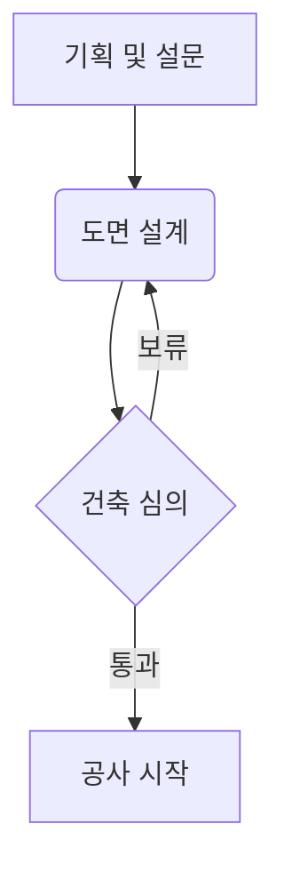

# ✍️ 옵시디안 글쓰기 및 구조화 가이드

이 문서는 옵시디안(Obsidian)에서 작성한 노트가 홈페이지 블로그에 가장 아름답고 체계적으로 반영될 수 있도록 돕는 스타일 및 문장 구조화 가이드입니다.

---

## 1. 프론트매터 (Frontmatter) 설정하기

노트 최상단에 아래 양식을 복사하여 붙여넣고 값을 작성해 주세요. 홈페이지가 자동으로 제목, 날짜, 태그 등을 분류합니다.

```yaml
---
title: 글 제목 (작성하지 않으면 파일명이 제목이 됩니다)
tags: [태그1, 태그2]
description: 홈페이지 글 목록에 노출될 간단한 한 줄 요약
publish: true (false로 하면 홈페이지에 노출되지 않고 비공개됩니다)
---
```

> [!tip] **💡 자동 날짜 업데이트**
> `date` 항목을 프론트매터에서 아예 삭제하거나 비워두면, **글을 수정하고 저장할 때마다 마지막 수정일(오늘 날짜)로 자동 갱신**되어 적용됩니다. 항상 최근 수정일을 표시하고 싶은 경우 `date` 라인을 제거해 주세요.

---

## 2. 권장하는 글 구조 (Template)

글의 가독성을 높이기 위해 아래 구조로 문단을 설계하는 것을 추천합니다.

### 📌 [도입부] 개요 및 핵심 질문
*   **목적:** 독자가 글을 읽어야 하는 이유를 설명합니다.
*   **활용 표현:**
    *   "이 글에서는 ~의 배경과 구체적인 해결 방안에 대해 알아봅니다."
    *   "~할 때 흔히 저지르는 실수는 무엇일까요?"
    *   "가장 먼저 확인해야 할 핵심 포인트를 요약해 드립니다."

> [!tip] **팁 (Tip) 콜아웃 사용하기**
> 도입부에서 독자의 시선을 끌고 싶다면 이처럼 콜아웃 박스를 사용해 보세요.
> 문법: `> [!tip] 내용`

### 🔍 [본론] 구조화된 설명 (H2, H3 활용)
*   **목적:** 본격적인 지식과 정보를 전달합니다. 대주제(`##`)와 소주제(`###`)를 분리해 주면 오른쪽 목차(TOC) 영역에 깔끔하게 생성됩니다.
*   **구조화 패턴:**
    1.  **현상 및 원인 분석:** 왜 이 문제가 발생하는가?
    2.  **해결 단계 제시:** 1단계, 2단계 등 순차적인 가이드 제공.
    3.  **구체적인 법규 및 기준 예시:** 신뢰성 있는 근거 제시.

### 📝 [결론] 요약 및 체크리스트
*   **목적:** 독자가 실천할 수 있는 핵심 요약을 제공합니다.
*   **마크다운 체크리스트 활용:**
    *   - [ ] 체크해야 할 첫 번째 항목
    *   - [ ] 확인이 필요한 두 번째 항목

---

## 3. 문장 흐름을 매끄럽게 만드는 연결 표현

논리적인 글쓰기를 돕는 자주 쓰는 표현 모음입니다. 글을 쓸 때 막히는 부분이 있다면 아래 표현들을 골라 사용해 보세요.

| 관계          | 추천 표현식                                                            | 예시                                          |
| :---------- | :---------------------------------------------------------------- | :------------------------------------------ |
| **논제 제시**   | "~에 관하여 자주 묻는 질문 중 하나는 바로 ~입니다.", "이 개념을 이해하기 위해 먼저 ~을 살펴봐야 합니다." | 이 개념을 이해하기 위해 먼저 용도변경의 법적 정의를 살펴봐야 합니다.     |
| **이유와 원인**  | "이러한 현상이 발생하는 원인은 두 가지입니다.", "~에 기인하여", "구체적인 배경을 살펴보면"           | 법적 분쟁이 자주 생기는 이유는 해석의 차이에 기인합니다.            |
| **인과 관계**   | "결과적으로", "이에 따라", "그로 인해 ~라는 결과가 초래됩니다.", "이를 바탕으로"               | 결과적으로 용도변경 전에 반드시 건축물대장을 확인해야 합니다.          |
| **대조 및 강조** | "반면", "그럼에도 불구하고", "주의해야 할 점은", "특히 염두에 두어야 할 부분은"                | 건축 심의는 비교적 빠릅니다. 반면 경관 심의는 시간이 오래 걸립니다.     |
| **예시 제공**   | "예를 들어", "대표적인 사례로", "일례로 ~을 들 수 있습니다."                           | 대표적인 사례로 상가 건물의 일부를 주거용으로 바꾸는 일례를 들 수 있습니다. |
| **결론 및 정리** | "요약하자면", "결론적으로", "한 줄로 요약하면 다음과 같습니다."                           | 요약하자면, 사전 검토 단계가 전체 프로젝트 기간을 좌우합니다.         |

---

## 4. 시각적 가독성 높이기 (Obsidian 문법)

### 🔗 연결 및 상호 참조 (Wikilinks)
관련된 다른 글이 있다면 `[[글 id]]` 또는 `[[글 id\|표시할 이름]]` 문법을 적극 사용해 주세요. 홈페이지에서도 자동으로 서로를 연결해 주는 백링크(Backlinks)와 연결망 그래프가 업데이트됩니다.
*   예시: `[[용도변경\|용도변경 절차 가이드]]`

### 💡 정보 시각화 (Callouts)
중요한 정보나 경고는 콜아웃 문법을 사용하면 홈페이지에 아름다운 박스로 렌더링됩니다.

> [!note] **노트 (Note)**
> `> [!note] 타이틀` 문법으로 작성합니다. 보충 설명이나 참고 자료를 넣을 때 좋습니다.

> [!warning] **경고 (Warning)**
> `> [!warning] 타이틀` 문법으로 작성합니다. 법적인 위험 요소나 꼭 지켜야 할 주의사항을 강조할 때 사용합니다.

> [!important] **중요 (Important)**
> `> [!important] 타이틀` 문법으로 작성합니다. 핵심적으로 짚고 넘어가야 할 공식 정보에 적합합니다.

### 🎨 텍스트 스타일링 (Text Styling)
글자 강조와 꾸미기를 통해 글의 강약을 조절해 보세요.
*   **굵게 (Bold):** `**강조할 내용**`으로 감싸면 **굵게** 표시됩니다.
*   *기울임 (Italic):* `*기울일 내용*`으로 감싸면 *이탤릭체*로 표시됩니다.
*   ~~취소선 (Strikethrough):~~ `~~취소할 내용~~`으로 감싸면 ~~취소선~~이 적용됩니다.
*   ==형광펜 (Highlight):== Obsidian 표준 형광펜 문법인 `==강조할 텍스트==`를 사용하면 노란색 형광펜 효과가 적용됩니다. (브라우저나 테마 환경에 맞춰 돋보이게 렌더링됩니다.)
*   `인라인 코드 (Inline Code):` 문장 중간에 키워드를 강조할 때 `` `코드` ``(백틱)로 감쌉니다.

### 🔢 불렛 및 번호 리스트 (Lists)
항목을 열거하거나 순서를 매길 때 사용합니다. 들여쓰기(Tab 또는 스페이스 4칸)를 통해 하위 항목 계층 구조를 만들 수 있습니다.

**1. 불렛 리스트 (Unordered List)**
```markdown
*   상위 항목 A
    *   하위 세부 항목 A-1
    *   하위 세부 항목 A-2
*   상위 항목 B
```
*   상위 항목 A
    *   하위 세부 항목 A-1
    *   하위 세부 항목 A-2
*   상위 항목 B

**2. 순서 번호 리스트 (Ordered List)**
```markdown
1.  첫 번째 프로세스
    1.  상세 준비 단계
    2.  서류 제출 단계
2.  두 번째 프로세스
```
1.  첫 번째 프로세스
    1.  상세 준비 단계
    2.  서류 제출 단계
2.  두 번째 프로세스

### 📊 표 작성법 (Tables)
정보를 비교 분석할 때는 마크다운 표가 가장 깔끔합니다. 세로선(`|`)과 가로선(`-`)을 조합해 만듭니다. 정렬 조건(`:---` 왼쪽, `---:` 오른쪽, `:---:` 가운데)을 지정하여 레이아웃을 예쁘게 정렬할 수 있습니다.

```markdown
| 구분 | 내용 (좌측 정렬) | 수량 (우측 정렬) | 비고 (가운데 정렬) |
| :--- | :--- | ---: | :---: |
| 1단계 | 사전 현장 답사 | 1회 | 필수 |
| 2단계 | 기본 도면 설계 | 3일 | 조율 가능 |
```

| 구분  | 내용 (좌측 정렬) | 수량 (우측 정렬) | 비고 (가운데 정렬) |
| :-- | :--------- | ---------: | :---------: |
| 1단계 | 사전 현장 답사   |         1회 |     필수      |
| 2단계 | 기본 도면 설계   |         3일 |    조율 가능    |
|     |            |            |             |

### ➖ 구분선 (Horizontal Rules)
글의 주제가 완전히 바뀌거나 흐름이 끊어질 때는 하이픈 세 개(`---`)를 사용하여 깔끔한 가로 구분선을 추가할 수 있습니다.

---

### 🎨 다양한 콜아웃 유형 (Advanced Callouts)
옵시디안은 정보의 성격에 따라 다양한 색상과 아이콘의 콜아웃(상자)을 기본적으로 제공합니다. 홈페이지에서도 동일하게 렌더링됩니다.

> [!info] 정보 (Info) / 노트 (Note)
> 파란색 계열 상자로 일반적인 안내나 추가 설명을 할 때 사용합니다.
> 문법: `> [!info] 내용` 또는 `> [!note] 내용`

> [!todo] 할 일 (Todo)
> 체크할 목록이나 향후 과제를 넣기 좋습니다.
> 문법: `> [!todo] 내용`

> [!tip] 팁 (Tip) / 힌트 (Hint)
> 유용한 실무 요령이나 팁을 전달할 때 사용하며 초록색 계열로 돋보입니다.
> 문법: `> [!tip] 내용` 또는 `> [!hint] 내용`

> [!warning] 경고 (Warning) / 주의 (Attention)
> 실수하기 쉬운 점이나 주의가 필요한 사항을 노란색/주황색 계열 상자로 표기합니다.
> 문법: `> [!warning] 내용` 또는 `> [!attention] 내용`

> [!danger] 위험 (Danger) / 에러 (Error)
> 심각한 오류나 법적인 불이익이 발생할 수 있는 위험 영역을 빨간색 상자로 강력하게 경고합니다.
> 문법: `> [!danger] 내용` 또는 `> [!error] 내용`

> [!example] 예시 (Example)
> 참고할 만한 실제 예제나 사례를 적을 때 유용한 보라색 상자입니다.
> 문법: `> [!example] 내용`

> [!quote] 인용구 (Quote)
> 명언이나 문헌 구절을 인용할 때 연한 회색 상자로 처리합니다.
> 문법: `> [!quote] 내용`

---

### 📝 고급 체크리스트 상태 (Task Statuses)
단순한 체크 해제(`- [ ]`)와 완료(`- [x]`) 외에도 옵시디안은 상태를 다채롭게 표현할 수 있습니다.
*   `- [ ]` 미완료 할 일
*   `- [/]` 진행 중인 일 (`[/]` 기호 사용)
*   `- [x]` 완료된 일
*   `- [-]` 취소/제외된 일 (`[-]` 기호 사용)

---

### 📐 수학 공식 입력 (Math & LaTeX)
건축 계산식이나 수학 공식은 달러 기호(`$`)를 사용하여 깔끔하게 표현할 수 있습니다.
*   **문장 중간 공식 (Inline):** `$E = mc^2$` 입력 시 $E = mc^2$ 로 렌더링됩니다.
*   **문단 공식 (Block):** 아래처럼 더블 달러(`$$`)로 감싸서 중앙 정렬 공식을 표기합니다.
    ```markdown
    $$
    A = b \times h
    $$
    ```
    $$
    A = b \times h
    $$

---

### 🔀 다이어그램 그리기 (Mermaid Diagrams)
텍스트로 구조도나 다이어그램을 쉽게 정의할 수 있는 `mermaid` 코드 블록입니다. 홈페이지에서도 동적 벡터 그래픽으로 예쁘게 렌더링됩니다.

````markdown

````


---

### ⚓ 블록 참조 및 특정 문서 위치 링크 (Block / Header Links)
옵시디안의 가장 강력한 링크 기능들도 홈페이지에서 완벽하게 작동하도록 설계되어 있습니다.
*   **특정 문단(헤더) 링크:** `[[문서명#헤더명]]`
    *   예시: `[[옵시디안_글쓰기_가이드#3. 문장 흐름을 매끄럽게 만드는 연결 표현]]`을 작성하면 해당 주제 위치로 정확히 화면을 스크롤시켜 줍니다.
*   **첨부 이미지 크기 조절:** `![[이미지파일명.png|300]]`과 같이 뒤에 `|가로픽셀`을 입력하면 이미지가 화면에서 해당 크기 비율로 예쁘게 축소/확대되어 노출됩니다.
*   **각주 (Footnotes):** 문장 끝에 `[^1]`를 달고, 본문 하단에 `[^1]: 각주 설명 내용`을 적어주면 논문 스타일의 깔끔한 주석이 생성됩니다.
*   **인터랙티브 캔버스 노드 링크 (Canvas Links):** `[[캔버스파일명.canvas#^노드ID|표시할이름]]` 문법을 사용하면 홈페이지 본문에서 해당 캔버스 카드를 가리키는 특수 링크가 생성됩니다.
    *   **호버 기능:** 마우스를 올리면 캔버스에 있는 원본 카드(이미지 또는 텍스트)의 미니 미리보기 팝업이 뜹니다.
    *   **클릭 기능:** 클릭 시 새 창으로 캔버스 뷰어가 열리며 해당 위치로 카메라가 알아서 이동하고 확대(Smooth Zoom-In)됩니다.
    *   *실시간 테스트 예제:*
        *   [[샘플캔버스.canvas#^node-img-1|🖼️ 캔버스 내 이미지 카드 줌인 및 호버 미리보기 테스트]]
        *   [[샘플캔버스.canvas#^node-text-1|📄 캔버스 내 텍스트 노드 줌인 및 호버 미리보기 테스트]]

---

## 5. 지식 연결망 구축하기 (링크, 태그, 백링크, 그래프 뷰)

옵시디안의 철학인 **"개인 지식 관리(PKM)"**의 핵심은 글을 서로 연결하여 하나의 거대한 생각의 네트워크를 만드는 것입니다. 홈페이지에서는 이 연결 관계를 완벽하게 추적하여 사용자에게 시각적으로 보여줍니다.

### 🔗 1. 위키링크 (WikiLinks)
가장 기본적이고 강력한 글과 글 사이의 연결 방법입니다. 
*   **기본 형식:** `[[대상 노트 파일명]]`
    *   예: `[[용도변경]]`
*   **텍스트 별칭(Alias) 지정 형식:** `[[대상 노트 파일명|본문에 표시할 이름]]`
    *   예: `[[용도변경|용도변경 인허가 절차]]`
*   **효과:** 이렇게 링크를 걸어주면 글을 읽는 독자가 클릭하여 즉시 해당 노트로 넘어갈 수 있을 뿐만 아니라, 하단의 **백링크**와 우측의 **연결망 그래프**에 선으로 연결되어 나타납니다.

### 🏷️ 2. 태그 (Tags)
글들의 주제를 분류하는 카테고리 역할을 합니다.
*   **프론트매터 활용법:** 글 최상단 설정 영역에 `tags: [건축, 법규]` 형태로 입력합니다.
*   **효과:** 
    *   홈페이지 오른쪽 사이드바에 **태그 클라우드(Tag Cloud)**가 자동으로 생성됩니다.
    *   특정 태그를 클릭하면 해당 태그를 가진 글들만 모아서 볼 수 있는 필터링 기능이 작동합니다.

### ↩️ 3. 백링크 (Backlinks)
*   **개념:** 현재 읽고 있는 페이지를 **참조(링크)하고 있는 다른 페이지들의 목록**입니다.
*   **효과:** 내가 `A` 문서에서 `B` 문서를 링크했다면, `B` 문서 하단에 "이 문서를 언급한 곳"으로 `A` 문서의 링크와 요약이 **자동으로 역추적되어 표시**됩니다. 사용자는 앞뒤 흐름을 양방향으로 쉽게 넘나들 수 있습니다.

### 🕸️ 4. 로컬 그래프 뷰 (Graph View)
*   **개념:** 오른쪽 사이드바에 들어가는 동적 네트워크 시각화 맵입니다.
*   **효과:**
    *   노트 간의 연결 관계(링크)를 노드와 선(Edge)의 인터랙티브 그래프로 나타냅니다.
    *   현재 열려 있는 노트를 중심으로 연결된 생각들이 어떻게 뻗어 나가는지 직관적으로 보여주며, 마우스로 움직이거나 그래프 상의 노드를 클릭하여 해당 글로 바로 이동할 수 있습니다.


